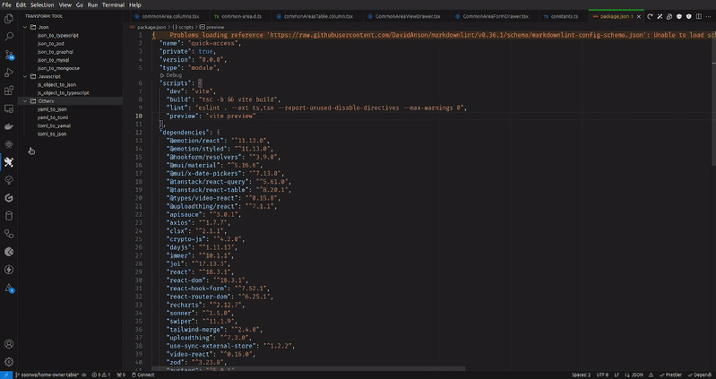

# Transform Tool Vscode

Effortlessly convert one schema to another directly in VS Code. For instance, transform JSON into a Zob object, TypeScript definitions, and more—all in just a few clicks.

This is an Adaptation of the original polygot transform-tool to vscode extension.

## Features

- convert selected text in editor
  
- convert json to typescript
- convert json to zod schema
- json to mysql conversion
- json to graphql conversion
- javascript object to json conversion
- javascript object to typescript conversion
- toml to yaml conversion
- yaml to toml conversion
- copy converted result to clipboard
- sync vscode theme information with settings
- easy side bar navigation

## Contribute

Please feel free to contribute to this project or raise an issue/ pull request. see our [contributions.md](CONTRIBUTIONS.md)

## Release Notes
