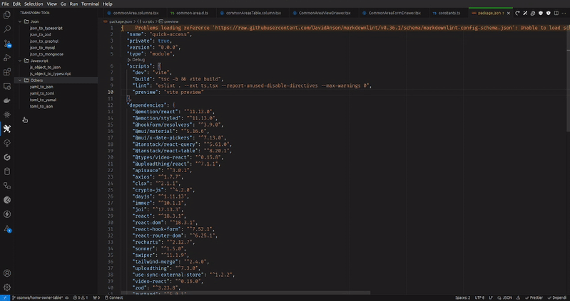

# AnyConverter — VS Code extension for JSON, TypeScript, Zod, YAML, cURL, and more

**AnyConverter** (Transform Tool) is a fast [Visual Studio Code](https://code.visualstudio.com/) extension that converts selected text or clipboard payloads between **JSON**, **TypeScript**, **Zod**, **GraphQL**, **SQL**, **YAML**, **TOML**, **CSV**, **.env**, **cURL**, **HTML/React**, and **CSS/Tailwind** — without leaving the editor.

Adapted from the original polyglot transform-tool, rebuilt for VS Code with a dedicated sidebar, theme-aware UI, and one-click copy.

## Install (quick)

1. **Marketplace (recommended):** open [AnyConverter on the Visual Studio Code Marketplace](https://marketplace.visualstudio.com/items?itemName=Sourcepride.transform-tool) and click **Install**.
2. **From VS Code / Cursor:** press `Cmd+Shift+X` (Mac) or `Ctrl+Shift+X` (Windows/Linux), search for **AnyConverter** or **transform-tool**, choose the extension published by **Sourcepride**, then **Install**.

After install, open the **Transform** activity bar icon to browse all converters.

## What you can convert

### JSON and schema targets

- JSON → TypeScript types/interfaces  
- JSON → Zod schema  
- JSON → GraphQL  
- JSON → MySQL schema  
- JSON → Mongoose schema  
- JSON → `.env` (environment-style key/value lines)  
- JSON → CSV  

### JavaScript literals

- JavaScript object → JSON  
- JavaScript object → TypeScript  

### YAML and TOML

- YAML → JSON  
- YAML → TOML  
- YAML → `.env`  
- TOML → YAML  
- TOML → JSON  

### CSV

- CSV → JSON  
- JSON → CSV  

### cURL → code

- cURL → Node.js (**axios**)  
- cURL → Node.js (**fetch**)  
- cURL → Python (**requests**)  
- cURL → Go  
- cURL → Java  

### Web / UI

- HTML → React (**TSX**)  
- CSS → **Tailwind** utility classes  

## Features

- **Transform selected text** from the editor or use the sidebar workflow  
  
- **Copy** converted output to the clipboard  
- **VS Code theme** integration for a consistent look  
- **Simple sidebar navigation** grouped by format (JSON, env, cURL, CSV, Web, and more)

## Commands

All transforms are available under the **Transform Tool** command category in the Command Palette (`Cmd+Shift+P` / `Ctrl+Shift+P`). You can also bind keys to your most-used converters in **Keyboard Shortcuts**.

## Contribute

Issues and pull requests are welcome. See [CONTRIBUTIONS.md](CONTRIBUTIONS.md) for guidelines.

## Release Notes

See the **CHANGELOG** tab on the [Marketplace listing](https://marketplace.visualstudio.com/items?itemName=Sourcepride.transform-tool) or your editor’s extension details page after each update.
